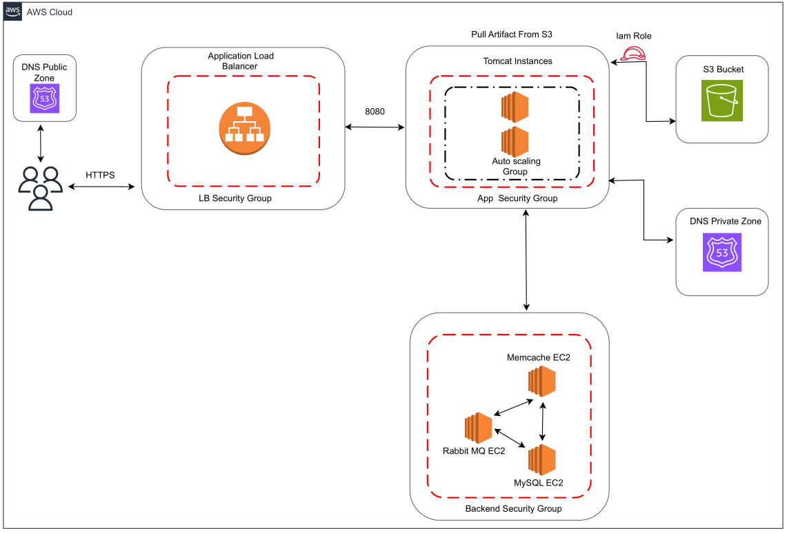

# AWS Deployment of Multi-Tier Java Web Application

## Deployment Architecture Diagram



## Project Overview
This project demonstrates the deployment of a scalable multi-tier Java web application on AWS using industry best practices. The architecture consists of:
- **Database Layer**: MariaDB (MySQL EC2 instance) for persistent data storage
- **Caching Layer**: Memcached EC2 instance to optimize performance
- **Message Broker**: RabbitMQ EC2 instance for handling asynchronous messaging
- **Application Layer**: Tomcat EC2 instances in an Auto Scaling Group to ensure scalability
- **Load Balancer**: AWS Application Load Balancer for traffic distribution
- **Artifact Storage**: Amazon S3 bucket for storing application artifacts
- **Domain Management**: Route 53 (public & private zones) for DNS resolution
- **Security Groups**: Configured at each layer for controlled access

## Flow of Execution
1. **Login to AWS Account** using valid credentials and set up AWS CLI.
2. **Create Key Pairs** for secure SSH access to EC2 instances.
3. **Create Security Groups** to enforce network access control:
   - Load Balancer Security Group
   - Application Security Group
   - Backend Security Group
4. **Launch EC2 Instances** with user data using BASH scripts:
   - `tomcat_ubuntu.sh` for application servers.
   - `nginx.sh` for reverse proxy setup.
   - `mysql.sh` for database initialization.
   - `memcache.sh` for caching layer configuration.
   - `rabbitmq.sh` for message queue setup.
5. **Configure Route 53 for DNS Management**
   - Create a public zone for external access.
   - Create a private zone for internal service discovery.
6. **Build the Java Application** using Maven:
   ```bash
   mvn clean package
   ```
7. **Upload the Built Artifact to S3 Bucket** for easy deployment:
   ```bash
   aws s3 cp target/myapp.war s3://your-bucket-name/
   ```
8. **Download and Deploy the Artifact to Tomcat EC2 Instances**
   - Configure IAM roles to allow EC2 instances access to S3.
   - Pull artifacts using AWS CLI:
     ```bash
     aws s3 cp s3://your-bucket-name/myapp.war /var/lib/tomcat/webapps/
     ```
   - Restart Tomcat to deploy the application.
9. **Set up ELB with HTTPS**
   - Create an Application Load Balancer.
   - Configure listeners to handle HTTPS traffic (443) and forward to Tomcat instances.
   - Use AWS Certificate Manager to issue an SSL certificate.
10. **Map ELB Endpoint to Website Name in Route 53 DNS**
    - Update  Route 53 DNS records to point to the ELB domain.
11. **Verify Deployment**
    - Access the application via the ELB URL or custom domain.
12. **Set Up Auto Scaling Group for Tomcat Instances**
    - Define scaling policies to ensure high availability.
    - Configure simple notification service alarms for proactive monitoring.

## File Structure
```
src/
├── main/
│   ├── java/com/visualpathit/account/
│   ├── resources/
│   ├── webapp/
│
├── test/java/com/visualpathit/account/
│
├── userdata/
│   ├── application.properties
│   ├── backend.sh
│   ├── memcache.sh
│   ├── mysql.sh
│   ├── nginx.sh
│   ├── rabbitmq.sh
│   ├── tomcat_ubuntu.sh
│
├── README.md
├── pom.xml
```

## Key Configurations
- **Tomcat Instances** pull the latest application artifact from S3 at startup.
- **Memcached** optimizes database queries by caching frequently accessed data.
- **RabbitMQ** ensures reliable messaging between application components.
- **MariaDB (MySQL)** provides durable and scalable data storage.
- **Auto Scaling** automatically adjusts the number of Tomcat instances based on traffic demand.
- **SNS** tracks system health and application performance.

## Prerequisites
- Active AWS account with IAM permissions.
- AWS CLI installed and configured.
- AWS Key Pair generated for SSH access.
- Maven installed for building the Java application.
- Route 53 domain registered (optional, for custom domain mapping).

## Troubleshooting
- **EC2 Instance Not Accessible?**
  - Verify security group inbound rules.
  - Check instance status in AWS console.
  - Ensure correct key pair is used for SSH access.
- **Application Not Deploying on Tomcat?**
  - Check `catalina.out` logs for errors.
  - Ensure artifact is correctly downloaded from S3.
- **Load Balancer Not Routing Traffic?**
  - Confirm target group health checks.
  - Ensure instances are registered correctly.

## Conclusion
This AWS deployment framework ensures a highly scalable, secure, and optimized setup for running a multi-tier Java web application in a cloud environment. By leveraging automation and best practices, the system guarantees reliability and performance.

